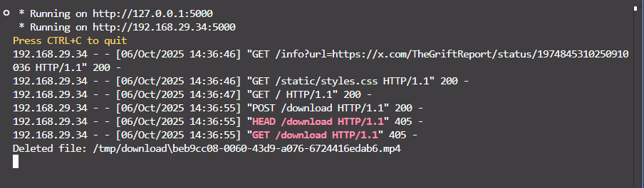

> [!CAUTION]
> due to Youtube restrictions
yt-video downloading not supported for now.
casue yt now block automated requests especially from cloud ip's like here Render.
but you can download videos from other platfroms.

# YouTube Video Downloader

A simple Flask-based web application that allows users to download YouTube videos not only youtube but also any kind of videos that yt-dlp officially supports. 

for examples some of are : 
---
Vimeo

Dailymotion

Twitter/X

TikTok

and more...
---
The app uses `yt-dlp` to download videos in different qualities, preview thumbnails, and automatically deletes downloaded videos after 1 minute to keep the server clean.

## Features
- **Download YouTube videos**: Users can download videos in low, medium, or best quality.
- **Preview thumbnails**: Shows a preview thumbnail of the video before downloading.
- **Automatic cleanup**: Downloaded videos are automatically deleted after 1 minute to prevent server clutter.

## Tech Stack
- **Backend**: Flask (Python web framework)
- **Video Downloading**: yt-dlp (for downloading videos)
- **Web UI**: HTML, CSS, and JavaScript
- **Temporary storage**: Downloads are stored temporarily in a folder and auto-deleted.

## Prerequisites
- Python 3.x
- `yt-dlp`
- `Flask`

for installation clone the repo 

git clone https://github.com/blackXploit-404/yt_downloader.git

then just run pip install -r requirements.txt --break-system-packages
or create virtual env for python 

once done run python app.py 

now open localhost:5000 on browser and you are good to go.
   
